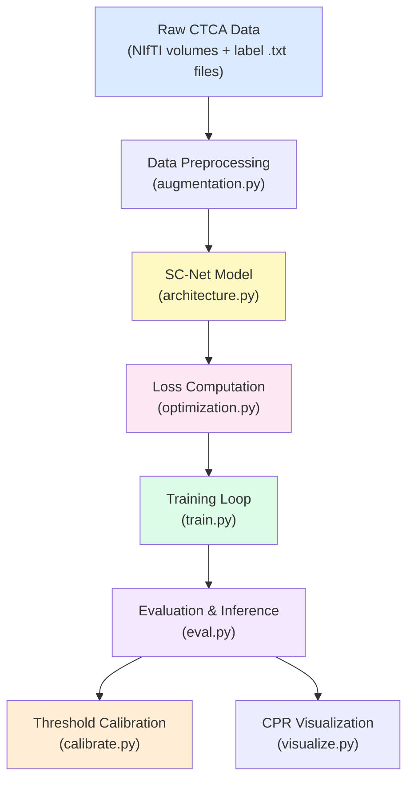
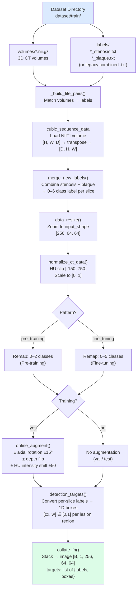
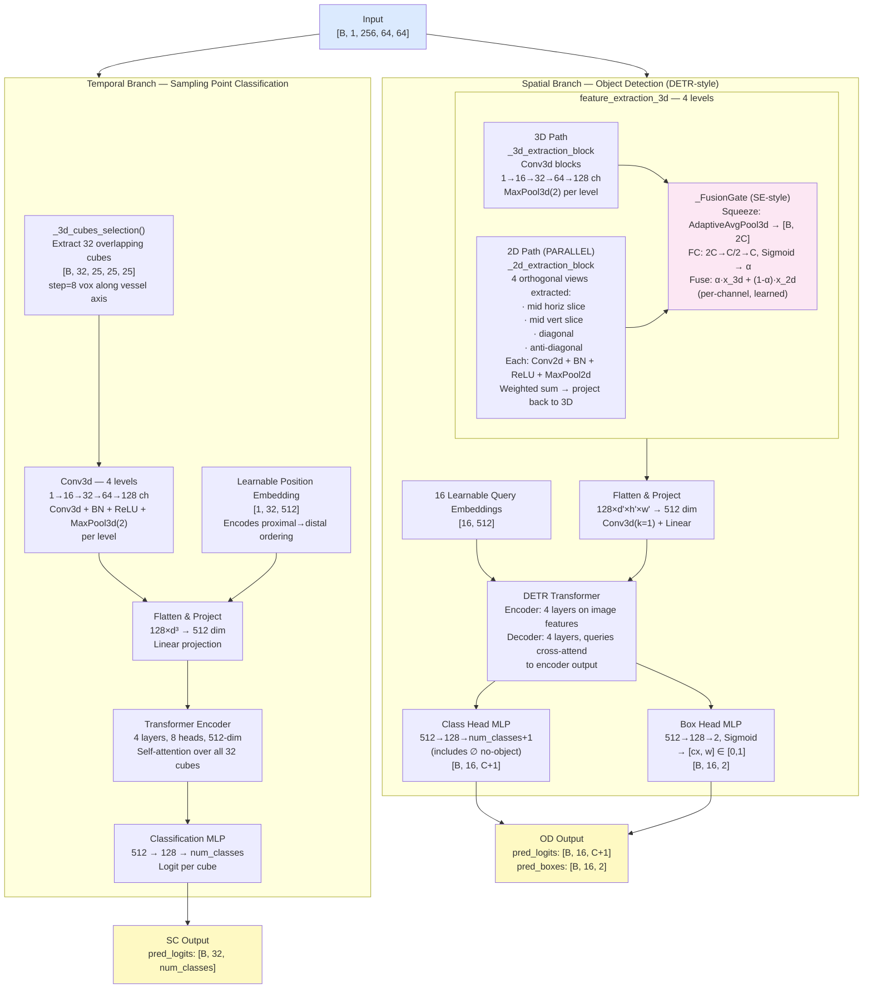
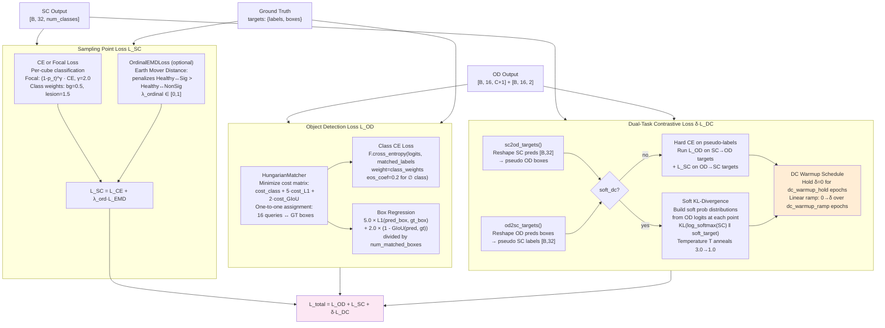
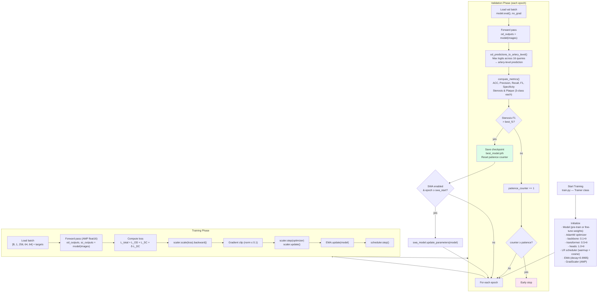
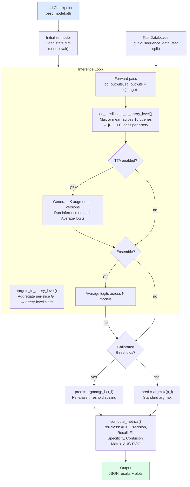
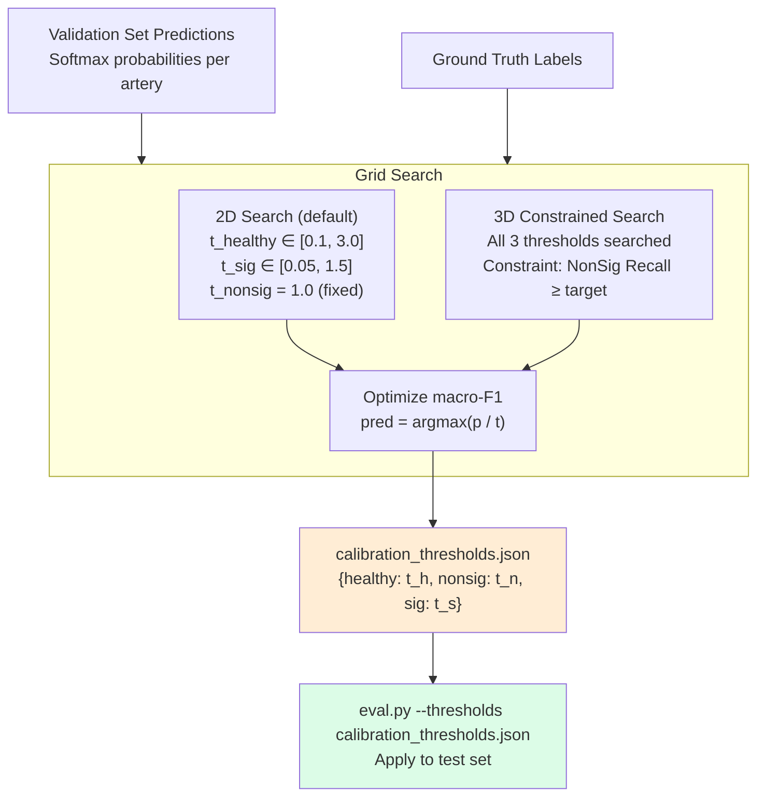
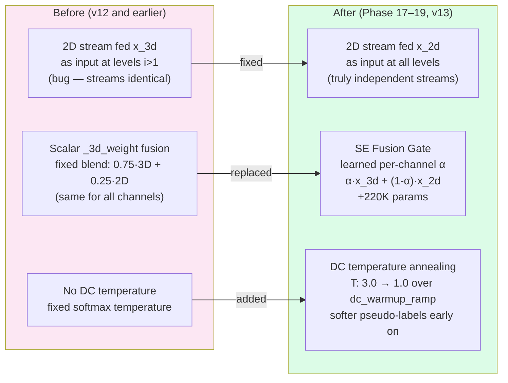

# SC-Net Pipeline Flowchart
*Updated: 2026-04-15 — reflects v12-ft best results & all Phase 17–19 architectural changes*

---

## 1. High-Level System Overview



---

## 2. Data Pipeline



---

## 3. Model Architecture



---

## 4. Loss Computation



---

## 5. Training Loop



---

## 6. Evaluation & Inference Pipeline



---

## 7. Threshold Calibration



---

## 8. Current Best Results — v12-ft

*Checkpoint: `checkpoints_v12_finetune/best_model.pth` (epoch 250)*
*Calibration: constrained — thresholds [H=2.80, NS=0.65, Sig=0.20]*

### Stenosis Classification (3-class)

| Class | F1 | Recall |
|---|---|---|
| Healthy | 0.868 | — |
| Non-significant | 0.613 | 0.639 |
| Significant | 0.735 | 0.733 |
| **Overall** | **0.739** | **0.736** |

Overall ACC: **0.736** · Precision: **0.743** · Specificity: **0.867**

### Plaque Composition (3-class)

| Class | F1 |
|---|---|
| Calcified | 0.790 |
| Non-calcified | 0.500 |
| Mixed | 0.214 |
| **Overall** | **0.502** |

### Version History (Best Calibrated Results)

| Version | Sten F1 | Sten ACC | Sten AUC | Sig Rec | NonSig Rec | Plaque F1 |
|---|---|---|---|---|---|---|
| v1 (pretrain) | 0.413 | 0.702 | 0.554 | — | — | 0.100 |
| v6-ft | 0.393 | 0.435 | 0.604 | 0.553 | — | 0.181 |
| v7-ft | 0.585 | 0.580 | 0.713 | 0.595 | 0.581 | 0.463 |
| v9-ft | 0.643 | 0.645 | 0.803 | 0.456 | 0.456 | 0.488 |
| **v12-ft** | **0.739** | **0.736** | — | **0.733** | **0.639** | **0.502** |

---

## 9. Key Architectural Changes (Phase 17–19, v13-ready)



---

## 10. File Map

```
CAD_diagnosis/
├── architecture.py       Model: spatio_temporal_semantic_learning, temporal, spatial, FusionGate
├── framework.py          High-level API: model init, dataset loading, loss setup
├── augmentation.py       Dataset class, online augment, clinically_credible_augmentation
├── config.py             DefaultConfig: all hyperparameters
├── train.py              Trainer class: full training loop + CLI args
├── optimization.py       Loss: L_OD + L_SC + δ·L_DC, OrdinalEMD, FocalLoss
├── scheduler_utils.py    LinearWarmupCosineDecay, CosineAnnealingWR, ModelEMA, build_param_groups
├── functions.py          HungarianMatcher, normalize_ct_data, _3d_cubes_selection, box utils
├── splitting.py          patient_level_split (prevent data leakage)
├── eval.py               Evaluation pipeline: metrics, TTA, ensemble, thresholds
├── calibrate.py          Per-class threshold grid search
├── visualize.py          CPR visualization, dual-bar (stenosis + plaque), paper Fig.3 style
├── cross_validate.py     Patient-level K-Fold cross validation
├── uncertainty.py        Monte Carlo Dropout uncertainty estimation
├── gradcam.py            3D Grad-CAM visualization on spatial backbone
├── generate_dummy_data.py Synthetic NIfTI volumes for pipeline testing
├── configs/
│   ├── pretrain_default.yaml
│   ├── finetune_default.yaml
│   ├── finetune_v9.yaml
│   └── finetune_v13.yaml   ← next run (Phase 17–19 changes)
└── tests/
    └── test_matcher.py     HungarianMatcher + class weight unit tests
```
