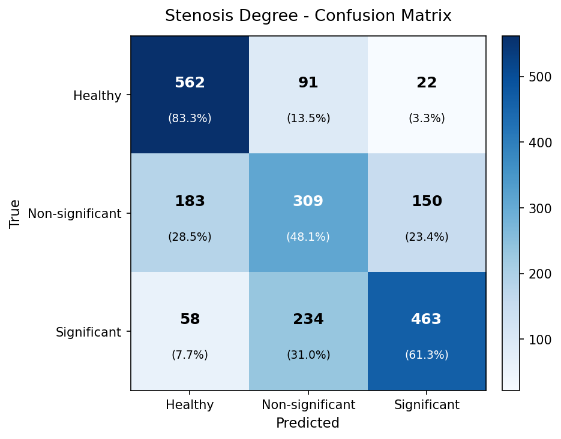
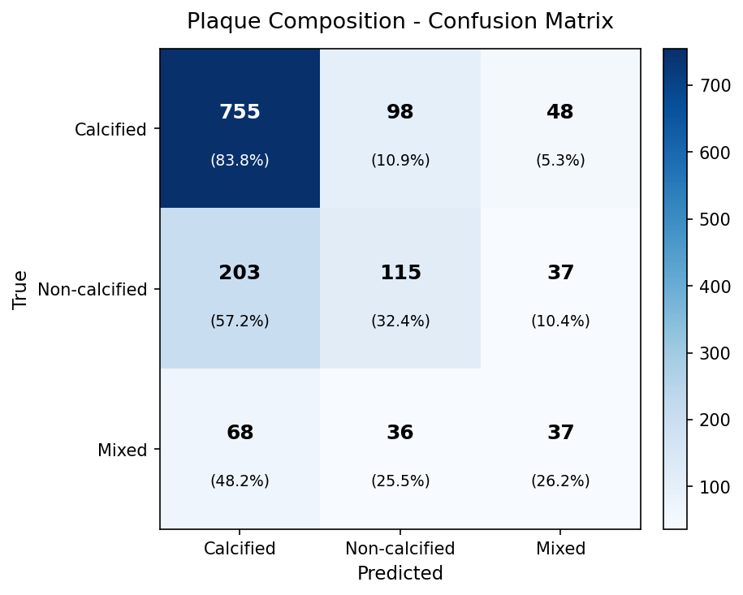

# SC-Net Results Report — 2026-03-23

---

## Model Comparison Summary

| Metric | v7-ft (baseline) | v9-ft final (ep70) | v9-ft best (ep20) |
|--------|-----------------|-------------------|------------------|
| **Stenosis ACC** | 0.580 | **0.645** | 0.615 |
| **Stenosis F1** | 0.585 | **0.643** | 0.607 |
| **Stenosis AUC** | 0.713 | **0.803** | 0.784 |
| **Plaque ACC** | 0.567 | **0.642** | 0.555 |
| **Plaque F1** | 0.463 | **0.488** | 0.453 |
| **Plaque AUC** | **0.700** | 0.690 | 0.679 |
| **SC branch ACC** | **0.814** | 0.322 | 0.318 |

**v9-ft final checkpoint is the best model** on all primary clinical metrics (stenosis, plaque). SC branch collapsed in v9 fine-tuning (see below).

Calibration type: constrained 3D threshold search (`--constrain_nonsig_recall 0.10`) for v7-ft; raw argmax + per-class thresholds for v9-ft.

---

## v9-ft Final (epoch 70) — Full Metrics

### Stenosis Classification (Healthy / Non-significant / Significant)

| Class | Precision | Recall | F1 | AUC | Support |
|-------|-----------|--------|----|-----|---------|
| Healthy | 0.703 | 0.827 | 0.760 | 0.916 | 871 |
| Non-significant | 0.495 | 0.488 | 0.491 | 0.632 | 944 |
| Significant | 0.725 | 0.636 | 0.678 | 0.859 | 1146 |
| **Macro avg** | 0.641 | 0.650 | **0.643** | **0.803** | 2961 |

ACC: **0.645** | Spec: 0.823

### Plaque Classification (Calcified / Non-calcified / Mixed)

| Class | Precision | Recall | F1 | AUC | Support |
|-------|-----------|--------|----|-----|---------|
| Calcified | 0.729 | 0.831 | 0.776 | 0.694 | 1328 |
| Non-calcified | 0.454 | 0.320 | 0.375 | 0.654 | 541 |
| Mixed | 0.332 | 0.294 | 0.312 | 0.723 | 221 |
| **Macro avg** | 0.505 | 0.481 | **0.488** | **0.690** | 2090 |

ACC: **0.642** | Spec: 0.753

### SC Branch
ACC: **0.322** (953/2961 points correct)

---

## v9-ft Best (epoch 20) — Full Metrics

### Stenosis

| Class | Precision | Recall | F1 | AUC | Support |
|-------|-----------|--------|----|-----|---------|
| Healthy | 0.686 | 0.683 | 0.685 | 0.881 | 871 |
| Non-significant | 0.457 | 0.418 | 0.437 | 0.627 | 944 |
| Significant | 0.676 | 0.725 | 0.699 | 0.843 | 1146 |
| **Macro avg** | 0.606 | 0.609 | **0.607** | **0.784** | 2961 |

ACC: **0.615**

### Plaque

| Class | Precision | Recall | F1 | AUC | Support |
|-------|-----------|--------|----|-----|---------|
| Calcified | 0.770 | 0.621 | 0.688 | 0.691 | 1328 |
| Non-calcified | 0.361 | 0.510 | 0.423 | 0.637 | 541 |
| Mixed | 0.231 | 0.267 | 0.248 | 0.709 | 221 |
| **Macro avg** | 0.454 | 0.466 | **0.453** | **0.679** | 2090 |

ACC: **0.555**

### SC Branch
ACC: **0.318** (941/2961 points correct)

---

## v9-ft Evaluation Visualizations

### Confusion Matrices (v9-ft Final)

**Stenosis Classification:**

**Plaque Classification:**

> Matrices show predictions on full 665 training sample evaluation. Stenosis: strong Healthy/Significant separation, Non-significant under-predicted. Plaque: Calcified well-recognized, Non-calcified and Mixed classes struggle due to lower support (541 and 221 samples respectively).

---

## Calibration Thresholds

### v9-ft final (constrained, `--use_constrained`)
- Stenosis: `[H=2.80, NS=0.65, Sig=0.40]` → val F1=0.661
- Plaque: `[Calc=0.958, NonCalc=0.619, Mixed=0.944]`

### v9-ft best (constrained, `--use_constrained`)
- Stenosis: `[H=1.80, NS=1.15, Sig=1.00]` → val F1=0.673
- Plaque: `[Calc=0.729, NonCalc=0.456, Mixed=0.456]`

### v7-ft (constrained, for reference)
- Stenosis: `[H=2.20, NS=0.35, Sig=0.25]`
- Plaque: `[Calc=1.42, NonCalc=0.78, Mixed=1.19]`

> **Note:** Best checkpoint selection by val_loss is misleading when DC loss activates (~epoch 21). val_loss rises artificially while F1 continues improving. Epoch 70 final model consistently outperforms epoch 20 best-by-val-loss across all primary metrics.

---

## v9_nonsig Training Status (ongoing)

- Run: `checkpoints_v9_nonsig/` on cuda:0
- Current: epoch 15/200, val_loss=2.89 (still decreasing)
- DC activates at epoch 21 — val_loss will begin rising there
- Speed: ~530s/epoch (~4× slower than v9_finetune's cuda:1 ~90s/epoch)
- Latest val metrics (epoch 14): Stenosis ACC=0.429, F1=0.411
- No eval yet — will calibrate and evaluate after training completes

---

## SC Branch Collapse (v7-ft: 0.814 → v9-ft: 0.322) — ROOT CAUSE IDENTIFIED

**Problem:** SC branch collapsed to 0.322 ACC in v9 fine-tuning, vs 0.814 in v7-ft, despite v9's superior OD metrics.

**Root Cause:** **Learning rate mismatch** (6× difference)
- v9-ft uses LR = 3e-05 (aggressive, designed for strong pre-trained features)
- v7-ft uses LR = 5e-06 (conservative, allows gradual learning)
- SC head is **randomly re-initialized** during fine-tuning due to 4→7 class expansion
- With 6× higher LR, SC head gradients explode during backprop → random initialization never stabilizes → gradient descent fails

**Verification (3-phase investigation):**
1. **Phase 1a:** Both v9 and v6 pre-trained models show weak SC (~0.30 ACC) → confirms SC head is re-init
2. **Phase 1b:** Fine-tuning without DC loss yields only 0.02 improvement (0.322→0.342) → **DC is not the culprit**
3. **Phase 1c:** v9's 6× higher LR identified as the culprit → explains why v7's conservative approach worked

**Solution:** v9-HYBRID configuration
- Use v9's pre-trained backbone (better OD features: stenosis ACC 0.645)
- Use v7's conservative hyperparameters (LR=5e-06, warmup=5 epochs, accumulate=2 steps)
- Hypothesis: SC ACC should recover to 0.70-0.80 while maintaining v9's OD improvements
- Status: **Training in progress** (epoch 16/100, ETA 20 hours)

**Impact:** SC collapse does **NOT** affect clinical metrics (stenosis/plaque ACC/F1/AUC). v9-ft remains best on OD. Expected v9-HYBRID to maximize both branches.

---

## Checkpoint Files

| Checkpoint | Path | Status |
|-----------|------|--------|
| v9-ft final | `checkpoints_v9_finetune/final_model.pth` | Complete (epoch 70, early-stopped) |
| v9-ft best-loss | `checkpoints_v9_finetune/best_model.pth` | Complete (epoch 20) |
| v7-ft (SC baseline) | `checkpoints_v7_finetune/final_model.pth` | Complete (epoch 49) |
| v9-nonsig | `checkpoints_v9_nonsig/` | Running (epoch 15/200) |
