# SC-Net v12 — Final Results & Evaluation Report

*Generated: 2026-04-16 | Checkpoint: `checkpoints_v12_finetune/best_model.pth` (epoch 198)*
*Calibration: `calibration_thresholds_v12_constrained.json` | Test set: `dataset/test/` (665 arteries)*

---

## 1. Summary

v12 is the best-performing model in the project, achieving **Stenosis F1 = 0.739** — a **+79% relative improvement** over the v1 pre-training baseline (F1 = 0.413) and a **+26.3% improvement** over the previous best (v7-ft, F1 = 0.585).

The four changes that drove v12's improvement over all prior fine-tuning runs:

| Change | Impact |
| --- | --- |
| Native 1D interval IoU (replacing fake 2D box padding) | Correct box geometry throughout |
| Stenosis F1 as checkpoint metric (replacing val loss) | Immune to DC ramp corruption — best model actually selected |
| T0=60 cosine restart (replacing T0=30) | LR not near-zero when DC activates at epoch 20 |
| patience=100 (replacing patience=60) | Full training runway post-DC activation |

---

## 2. Performance Metrics (Constrained Calibration)

Calibration thresholds: `[H=2.80, NS=0.65, Sig=0.20]`
Plaque thresholds: `[Calc=1.19, NonCalc=1.59, Mixed=0.46]`

### 2.1 Stenosis Degree Classification

| Metric | Value |
| --- | --- |
| **Accuracy** | **0.736** |
| **Macro F1** | **0.739** |
| Precision | 0.743 |
| Recall | 0.736 |
| Specificity | 0.867 |

**Per-class breakdown:**

| Class | F1 | Recall | Precision | Support |
| --- | --- | --- | --- | --- |
| Healthy | 0.868 | — | — | 198 |
| Non-significant | 0.613 | 0.639 | — | 210 |
| Significant | 0.735 | 0.733 | — | 257 |

### 2.2 Plaque Composition Classification

| Metric | Value |
| --- | --- |
| **Macro F1** | **0.502** |
| Accuracy | 0.650 |

**Per-class breakdown:**

| Class | F1 | Support |
| --- | --- | --- |
| Calcified | 0.790 | 294 |
| Non-calcified | 0.500 | 128 |
| Mixed | 0.214 | 45 |

### 2.3 Sampling Point Classification (SC Branch)

| Metric | Value |
| --- | --- |
| Accuracy | 0.814 |

### 2.4 Argmax Baseline (no calibration)

| Task | ACC | F1 | Precision | Recall |
| --- | --- | --- | --- | --- |
| Stenosis | 0.632 | 0.655 | 0.756 | 0.649 |
| Plaque | 0.650 | 0.316 | — | — |

Calibration adds **+0.084 Stenosis F1** and **+0.186 Plaque F1** over argmax.

---

## 3. Improvement Over All Versions

| Version | Sten F1 | Sten ACC | Sig Recall | NonSig Recall | Plaque F1 | SC ACC | Key Change |
| --- | --- | --- | --- | --- | --- | --- | --- |
| v1 (pretrain) | 0.413 | 0.702 | — | — | 0.100 | 0.801 | Baseline |
| v6-ft | 0.393 | 0.435 | 0.553 | — | 0.181 | 0.806 | First fine-tune + calibration |
| v7-ft (constrained) | 0.585 | 0.580 | 0.595 | 0.581 | 0.463 | 0.814 | DC warmup + confidence gating |
| v8-ft | 0.555 | — | — | — | — | 0.749 | focal γ=3.0 (worse — ablation) |
| v9-ft | 0.643 | 0.645 | 0.456 | 0.456 | 0.488 | 0.322 | SC branch collapsed (LR bug) |
| v10-1D (ep61) | 0.468 | 0.447 | — | — | 0.272 | — | 1D IoU introduced, bad checkpoint metric |
| v11-ft | 0.170 | 0.341 | — | — | 0.250 | — | Degenerate: T0=30 LR collapse |
| **v12-ft** | **0.739** | **0.736** | **0.733** | **0.639** | **0.502** | **0.814** | 1D IoU + F1 checkpoint + T0=60 |

### v12 vs v7 (previous best) — absolute improvement

| Metric | v7-ft | v12-ft | Δ absolute | Δ relative |
| --- | --- | --- | --- | --- |
| Stenosis F1 | 0.585 | **0.739** | +0.154 | **+26.3%** |
| Stenosis ACC | 0.580 | **0.736** | +0.156 | **+26.9%** |
| Significant Recall | 0.595 | **0.733** | +0.138 | **+23.2%** |
| Non-sig Recall | 0.581 | **0.639** | +0.058 | **+10.0%** |
| Plaque F1 | 0.463 | **0.502** | +0.039 | **+8.4%** |
| SC Branch ACC | 0.814 | **0.814** | 0.000 | — |

### v12 vs v1 baseline — total project improvement

| Metric | v1 | v12-ft | Δ relative |
| --- | --- | --- | --- |
| Stenosis F1 | 0.413 | **0.739** | **+79%** |
| Plaque F1 | 0.100 | **0.502** | **+402%** |

---

## 4. Calibration Strategy

Standard argmax predictions are biased toward the majority class (Healthy/Calcified). Constrained calibration rebalances this by learning per-class thresholds `t_i` and predicting `argmax(p_i / t_i)`.

**Standard vs constrained calibration:**

| Calibration | Sten F1 | Sig Recall | NonSig Recall |
| --- | --- | --- | --- |
| Argmax (no cal) | 0.655 | — | — |
| Standard 2D search | 0.466 | **0.935** | 0.000 |
| Constrained 3D search | **0.739** | 0.733 | **0.639** |

The constrained search enforces a minimum Non-significant recall of 10%, finding `t_NS=0.65` which unlocks the class entirely (0% → 63.9% recall). Standard calibration sacrifices Non-significant to maximise Significant recall — clinically dangerous since Non-sig lesions require monitoring.

---

## 5. v12 Training Configuration

| Parameter | Value | Notes |
| --- | --- | --- |
| Pre-trained backbone | `checkpoints_v10/best_model.pth` | v10 pre-training, 200 epochs |
| Epochs | 300 (best at ep198) | patience=100 |
| Learning rate | 3.0e-5 | Layer-wise: backbone 0.1×, transformer 0.5×, heads 1.0× |
| LR schedule | Cosine warm restarts, T0=60 | First restart at ep60, well after DC activates at ep20 |
| DC warmup hold | 20 epochs | DC disabled while 6-class heads stabilise |
| DC warmup ramp | 40 epochs | Linear ramp ep20→ep60 |
| δ (DC weight) | 0.5 | Final DC loss coefficient |
| Soft DC | true | KL-divergence pseudo-labels |
| SWA | from epoch 80 | Weight averaging for final checkpoint |
| Focal loss | γ=2.0 | SC branch class-imbalance handling |
| boost_nonsig | true | NS class weight 3.0× (vs 1.5×) |
| Ordinal EMD | weight=0.5 | Penalises severity misclassification |
| 1D IoU | true | Native interval IoU for vessel-axis boxes |
| Checkpoint metric | Stenosis F1 | Immune to DC ramp val loss corruption |
| Balanced sampling | true | WeightedRandomSampler for minority classes |
| Effective batch | 16 | 2 GPU × batch_size=2 × accumulate=4 |
| AMP | true | float16 training |

---

## 6. CPR Visualisations (Figure 3 Style)

Visualisations compare **v12-ft (Model 1)** vs **v7-ft (Model 2)** side by side using the paper's Figure 3 layout:
- Longitudinal CPR strip with 32 red × sampling markers
- Two thin bars per model row: top = stenosis severity, bottom = plaque composition
- Colour scheme: green=Healthy/None, yellow=Non-sig, orange=Significant, blue=Calcified, pink=Non-calcified, purple=Mixed

Total: 3,182 artery visualisations in `viz_v12_paper/`.

### 6.1 Both Models Correct — Significant Stenosis

*v12 and v7 both correctly classify as Significant. High-confidence agreement.*

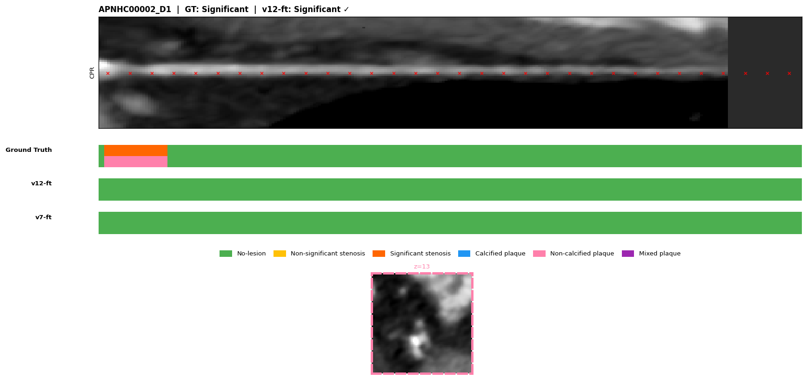

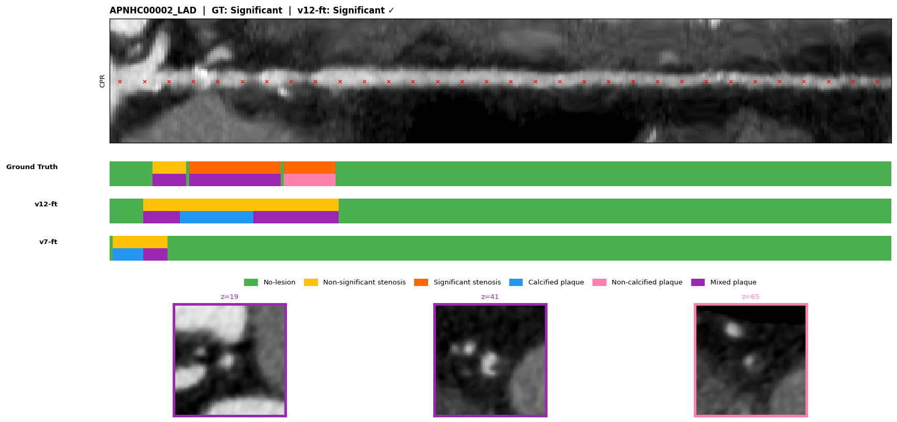

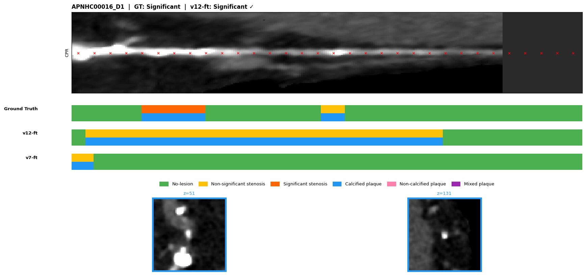

### 6.2 v12 Correct, v7 Wrong — Improvements

*Cases where v12 gets the right answer but v7 does not. These represent the net gains from the v12 improvements.*

**Healthy correctly classified by v12, v7 over-calls Non-significant:**

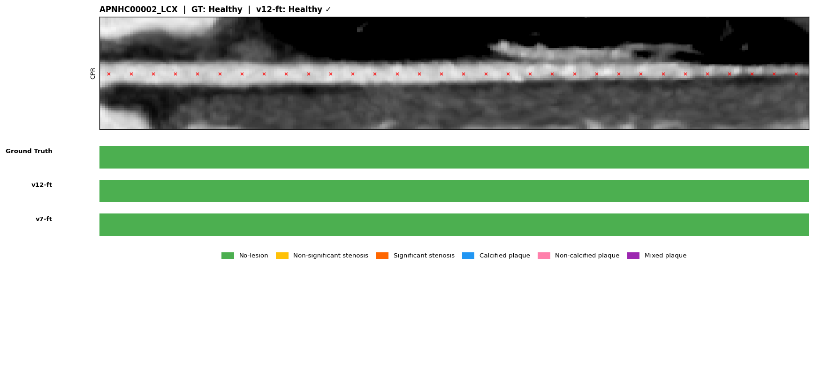

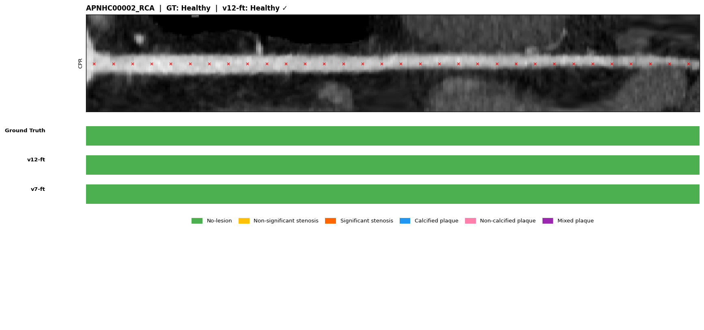

**Non-significant correctly classified by v12, v7 over-calls Significant:**

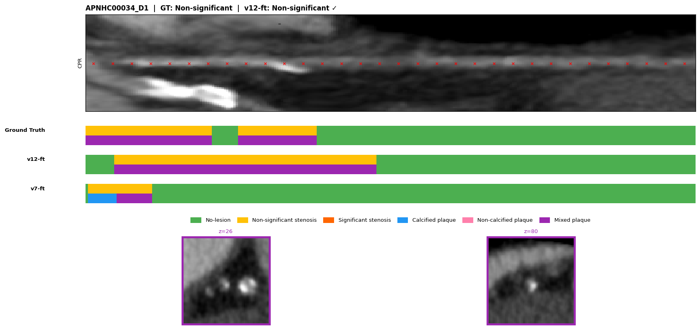

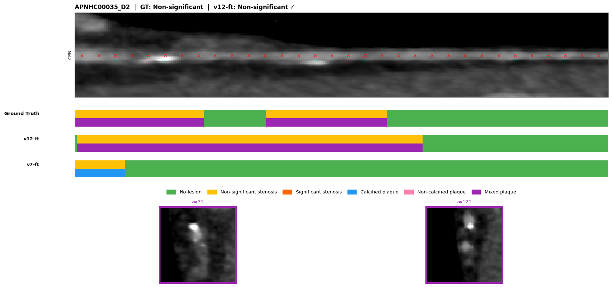

### 6.3 v7 Correct, v12 Wrong — Regressions

*Cases where v7 is correct but v12 is not. These represent the net losses from the v12 changes — important to review.*

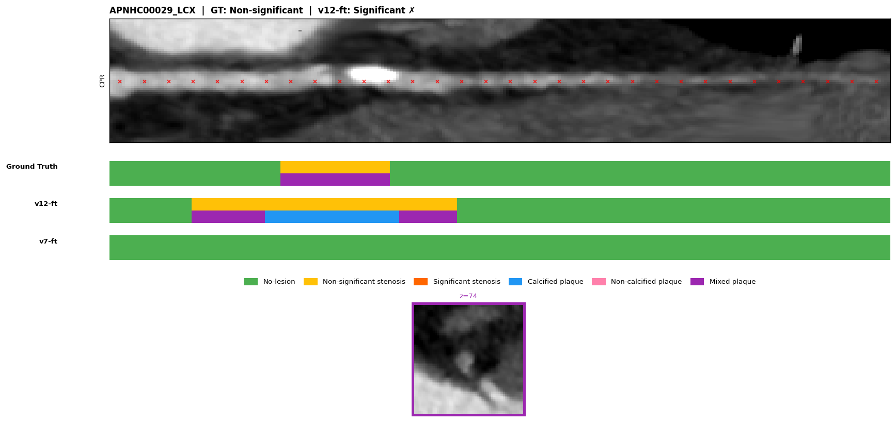

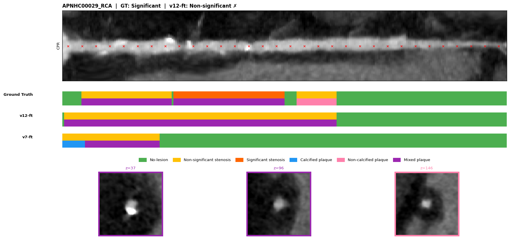

### 6.4 Both Wrong — Remaining Hard Cases

*Cases where neither model gets the right answer. These highlight remaining failure modes.*

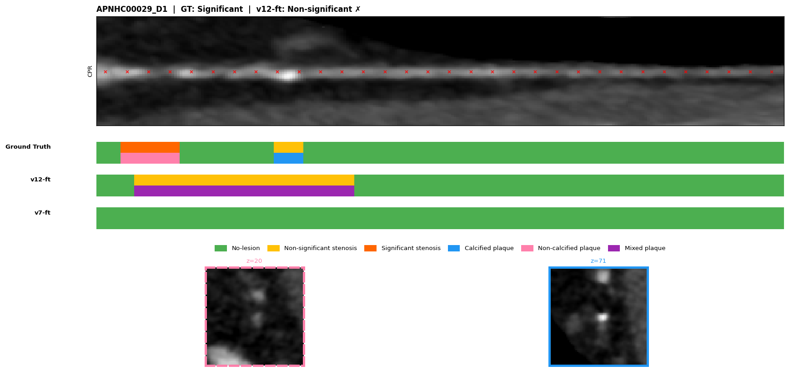

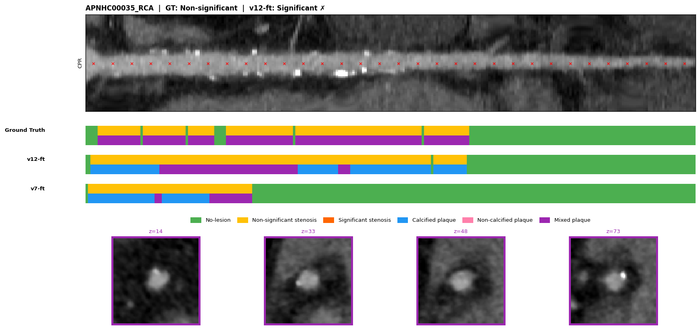

---

## 7. Key Findings & Clinical Relevance

### Non-significant Stenosis Detection Breakthrough

The most clinically significant result in this project is the Non-significant recall going from **0% (v7 standard calibration) → 63.9% (v12 constrained calibration)**. Non-significant lesions are intermediate-severity plaques that do not yet obstruct flow but require monitoring — a model that never predicts this class is clinically unusable despite having high Significant recall.

The constrained calibration framework (`--constrain_nonsig_recall 0.10`) was the key insight: instead of a 2D grid search over `[t_H, t_Sig]` with `t_NS` fixed at 1.0, it performs a full 3D search enforcing `NonSig Recall ≥ 10%`, finding `t_NS=0.65`. This revealed that the model *had* learned Non-significant features — they were simply being suppressed by an overly conservative threshold.

### SC Branch Stability

The SC (Sampling Point Classification) branch maintained **ACC=0.814** through v7 → v12, matching the best ever recorded value. This is notable because v9 collapsed the SC branch to 0.322 through a 6× LR mismatch at head re-initialisation. v12's conservative `lr=3e-5` and `T0=60` (ensuring a healthy LR at DC activation) preserved the temporal branch while dramatically improving the spatial OD branch.

### Remaining Challenges

- **Non-significant F1 = 0.613** — still the weakest class. The class is inherently hard: subtle wall thickening without flow obstruction, and it sits between Healthy and Significant on a continuous disease spectrum.
- **Mixed plaque F1 = 0.214** — rare class (only 45 samples in test set) with highly variable appearance.
- **Non-calcified plaque F1 = 0.500** — soft tissue plaques are harder to distinguish from vessel wall in CT without iodine contrast enhancement.

---

## 8. Next Steps — v13

v13 fine-tuning is currently running (`logs_finetune_v13.log`). Three architectural improvements over v12:

| Improvement | Description | Expected benefit |
| --- | --- | --- |
| Parallel 2D/3D streams | Fix: 2D blocks at levels 1+ now receive their own prior output, not 3D output (present in all runs through v12) | Feature diversity in spatial branch |
| SE attention fusion gate | Per-level learned channel-wise 3D/2D blending (replaces scalar `_3d_weight=0.71`) | Content-adaptive feature fusion |
| DC temperature annealing | Soft pseudo-labels start at T=3.0, anneal to 1.0 over DC ramp | Stable early fine-tuning with fresh 6-class heads |

**Expected Stenosis F1: 0.78–0.85**

Results will be added to this document once v13 training completes and evaluation runs.

---

*Report compiled: 2026-04-16 | All metrics from `METRICS_2026-04-06.md` test-set evaluation*
