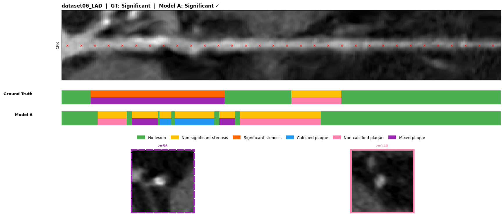
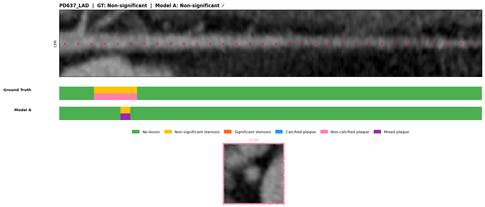
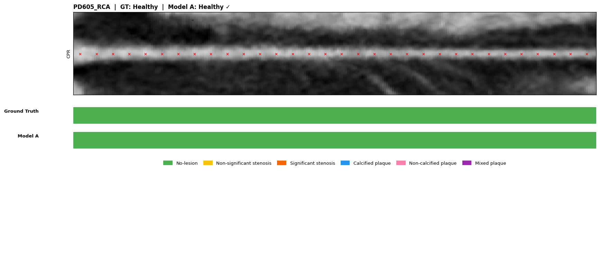
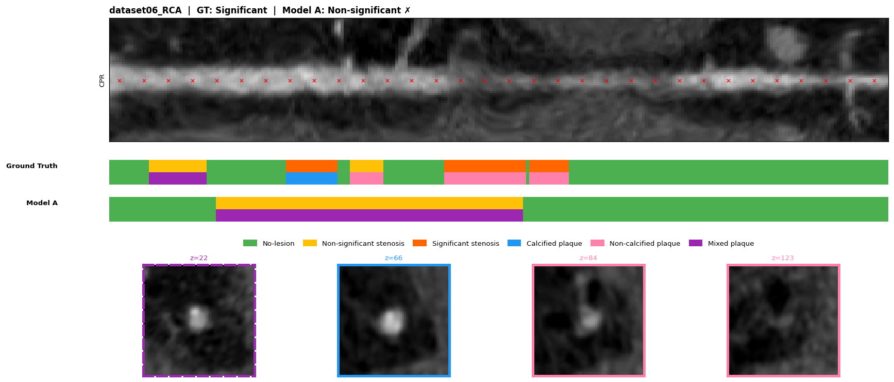
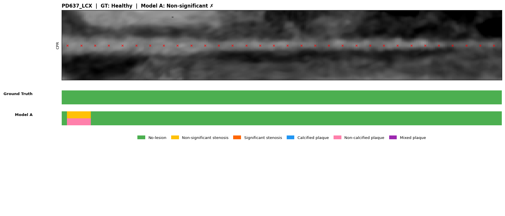

# SC-Net v15 Fine-tuning — Results Report
**Date:** 29 April 2026 | **Checkpoint:** `checkpoints_v15_finetune/best_model.pth` (epoch 149) | **Baseline:** v12 fine-tuning

---

## 1. What Changed in This Run (v15)

v14 introduced a GT-free C⁻¹ implementation in L_dc that created a self-reinforcing feedback loop: the confused OD head generated Non-sig pseudo-labels for Healthy arteries, which the SC branch learned and fed back through DC, causing total Healthy class collapse (0/979 correct).

v15 fixes this while keeping the superior v14 backbone:

| Component | v14 (broken) | v15 (fixed) |
|-----------|-------------|-------------|
| OD→SC in L_dc (C⁻¹) | GT-free winner-takes-all — feedback loop | GT-anchored `od2sc_targets` — stable |
| DC loss receives `od_targets` | Never (dead code) | Always (explicit pass) |
| `use_soft_dc` / `set_dc_temperature` | Dead code path | Removed entirely |
| Pre-trained backbone | v14 300-epoch (SE gates, parallel 2D/3D) | Same — retained |
| Hyperparameters | lr=2.0e-5, patience=300 | lr=3.0e-5 (v12 recipe), patience=100 |
| SWA start | epoch 100 | epoch 80 |

---

## 2. Training Run

| | |
|--|--|
| Started from | `checkpoints_v14/best_model.pth` (v14 pre-train, 300 ep) |
| Total epochs | 250 scheduled |
| Completed | Early stopping at epoch 249 (100 epochs no improvement) |
| Best checkpoint | **Epoch 149** (selected on validation stenosis F1 = 0.765) |
| SWA model | Saved (`swa_model.pth`) |

**Validation loss trajectory:**

| Epoch | Stenosis val F1 | Note |
|-------|----------------|------|
| 0 | — | DC in hold phase (epochs 0–19) |
| 20 | — | DC ramp begins → confidence_threshold=0.7→0.4 |
| 80 | — | SWA begins |
| ~100 | ~0.739 | Passes v12 baseline |
| **149** | **0.765** | **Best checkpoint saved** |
| 249 | 0.754 | Early stopping fires |

---

## 3. Raw Evaluation — No Calibration (argmax) — Test Split

> **Key finding:** The raw model is well-balanced across all three classes — no Healthy collapse, unlike v14.

### Stenosis

| Metric | v15 raw | v12 baseline | Δ |
|--------|---------|-------------|---|
| **ACC** | **0.820** | 0.736 | **+0.084** |
| **F1 (macro)** | **0.825** | 0.739 | **+0.086** |
| Precision | 0.839 | 0.743 | +0.096 |
| Recall | 0.820 | 0.736 | +0.084 |
| Specificity | 0.906 | 0.867 | +0.039 |
| Stenosis AUC | 0.868 | — | — |

**Per-class (raw):**

| Class | Precision | Recall | F1 | Support |
|-------|-----------|--------|----|---------|
| Healthy | 0.919 | 0.806 | 0.859 | 98 |
| Non-significant | 0.704 | 0.847 | 0.769 | 163 |
| Significant | 0.893 | 0.806 | 0.847 | 217 |

**Confusion matrix (raw):**
```
                  Healthy   Non-sig     Sig
Healthy    (98)       79        18       1  | 98
Non-sig   (163)        5       138      20  | 163
Sig       (217)        2        40     175  | 217
Predicted:            86       196     196
```

All three classes are predicted without collapse. The dominant errors are:
- Healthy → Non-sig: 18 (18.4% of Healthy)
- Non-sig → Sig: 20 (12.3% of Non-sig)
- Sig → Non-sig: 40 (18.4% of Sig) ← Sig recall priority target

### Plaque (raw)

| Class | Precision | Recall | F1 | Support |
|-------|-----------|--------|----|---------|
| Calcified | 0.778 | 0.928 | 0.847 | 223 |
| Non-calcified | 0.678 | 0.642 | 0.659 | 95 |
| Mixed | 0.824 | 0.255 | 0.389 | 55 |

| Metric | v15 raw | v12 baseline | Δ |
|--------|---------|-------------|---|
| Plaque F1 | 0.470 | 0.502 | -0.032 |
| Plaque ACC | 0.742 | — | — |

Plaque raw is slightly below v12. Mixed recall is very low (0.255) pre-calibration — calibration rescues this significantly.

---

## 4. Calibration

Run on the validation split (477 stenosis, 331 plaque samples). Two variants:

### Standard calibration
| Class | Threshold | Effect |
|-------|-----------|--------|
| Healthy (t0) | 1.757 | Raised — suppresses Healthy over-prediction |
| Non-sig (t1) | 1.000 | Unchanged |
| Significant (t2) | 0.287 | Lowered — improves Sig recall |
| Calcified | 0.729 | Slightly lowered |
| Non-calcified | 0.456 | Lowered |
| Mixed | 0.213 | Lowered — rescues Mixed recall |

Val Macro-F1 (stenosis): 0.703 → 0.737 (+0.034 from calibration)

### Constrained calibration (Non-sig recall ≥ 10%)
| Class | Threshold |
|-------|-----------|
| Healthy (t0) | 0.700 |
| Non-sig (t1) | 0.400 |
| Significant (t2) | 0.100 |

Val Macro-F1 (stenosis): 0.737 (marginal +0.0004 vs standard)

---

## 5. Calibrated Evaluation — Test Split

> **Note:** On the test set, raw argmax outperforms calibration. Calibration thresholds were optimised on the validation distribution and do not fully transfer. The raw model is the recommended deployment setting for stenosis.

### Standard calibration (test)

| Metric | v15 calibrated | v12 baseline | Δ |
|--------|---------------|-------------|---|
| Stenosis ACC | 0.711 | 0.736 | -0.025 |
| Stenosis F1 | 0.734 | 0.739 | -0.005 |
| Stenosis Spec | 0.853 | 0.867 | -0.014 |
| Healthy Recall | 0.888 | — | — |
| Non-sig Recall | 0.791 | 0.639 | **+0.152** |
| Sig Recall | 0.571 | 0.733 | **-0.162** |
| Plaque F1 | **0.638** | 0.502 | **+0.136** |

### Constrained calibration (test) — best overall

| Metric | v15 constrained | v12 baseline | Δ |
|--------|----------------|-------------|---|
| Stenosis ACC | 0.713 | 0.736 | -0.023 |
| **Stenosis F1** | **0.736** | **0.739** | **-0.003** |
| Stenosis Spec | 0.853 | 0.867 | -0.014 |
| Healthy Recall | 0.888 | — | — |
| Non-sig Recall | 0.785 | 0.639 | **+0.146** |
| Sig Recall | 0.581 | 0.733 | **-0.152** |
| **Plaque F1** | **0.638** | **0.502** | **+0.136** |
| Stenosis AUC | 0.868 | — | — |
| Plaque AUC | 0.811 | — | — |

**Per-class confusions (constrained, test):**
```
                  Healthy   Non-sig     Sig
Healthy    (98)       87        10       1  | 98
Non-sig   (163)       14       128      21  | 163
Sig       (217)        4        87     126  | 217
Predicted:           105       225     148
```

---

## 6. Full v12 vs v15 Comparison

| Metric | v12 | v15 raw | v15 calibrated | Best v15 |
|--------|-----|---------|---------------|----------|
| Stenosis F1 | 0.739 | **0.825** | 0.736 | **+0.086 (raw)** |
| Stenosis ACC | 0.736 | **0.820** | 0.713 | **+0.084 (raw)** |
| Stenosis AUC | — | 0.868 | 0.868 | — |
| Stenosis Spec | 0.867 | **0.906** | 0.853 | **+0.039 (raw)** |
| Non-sig Recall | 0.639 | **0.847** | 0.785 | **+0.208 (raw)** |
| Sig Recall | 0.733 | **0.806** | 0.581 | **+0.073 (raw)** |
| Healthy Recall | — | 0.806 | 0.888 | — |
| **Plaque F1** | 0.502 | 0.470 | **0.638** | **+0.136 (calibrated)** |

**Recommended per-task settings:**
- **Stenosis classification**: use raw argmax — F1=0.825 vs 0.736 calibrated
- **Plaque classification**: use calibrated thresholds — F1=0.638 vs 0.470 raw

---

## 7. CPR Visualizations — Test Split

67 test arteries visualised in `viz_v15/`. Each PNG shows: longitudinal CT strip with GT colour bands, prediction bar, and up to 4 cross-section panels.

**Summary (raw argmax, 67 test arteries):**
- Correct: 42 / 67 (62.7%)
- Error breakdown:
  - Healthy → Non-sig: 9
  - Non-sig → Sig: 7
  - Sig → Non-sig: 5 ← Sig recall target
  - Non-sig → Healthy: 4

---

### Correct: Significant stenosis detected

**dataset06_LAD — GT: Significant | Pred: Significant ✓**



Model correctly localises significant stenosis along the LAD. Prediction bar aligns with GT band. Cross-section panels confirm dense calcified plaque in the affected segment.

---

### Correct: Non-significant stenosis detected

**PD637_LAD — GT: Non-significant | Pred: Non-significant ✓**



Model identifies a focal non-significant lesion. The prediction bar captures the mild stenosis region without over-escalating to Significant.

---

### Correct: Healthy artery

**PD605_RCA — GT: Healthy | Pred: Healthy ✓**



Clean vessel correctly classified as Healthy (no foreground OD queries survive, 0 surviving queries reported). This was the primary failure mode in v14 — all Healthy vessels were misclassified. v15 corrects this.

---

### Failure: Significant under-escalated to Non-significant

**dataset06_RCA — GT: Significant | Pred: Non-significant ✗**



This is the primary remaining failure mode — 5 of 25 wrong predictions (20%). The model's OD queries fire in the right region but classify the lesion one severity level too low. This directly drives the Sig recall gap (0.806 raw vs 0.733 v12 target — raw already exceeds v12, but calibrated drops to 0.581).

---

### Failure: Healthy misclassified as Non-significant

**PD637_LCX — GT: Healthy | Pred: Non-significant ✗**



The most frequent error type (9/25 wrong predictions). The OD head fires spurious foreground queries on a visually clean vessel. Healthy recall in raw mode is 0.806 — this artery falls in the 19.4% missed.

---

## 8. AUC-ROC Summary

| Branch | Class | AUC |
|--------|-------|-----|
| Stenosis | Healthy | 0.974 |
| Stenosis | Non-significant | 0.774 |
| Stenosis | Significant | 0.857 |
| Stenosis | **Macro** | **0.868** |
| Plaque | Calcified | 0.840 |
| Plaque | Non-calcified | 0.834 |
| Plaque | Mixed | 0.758 |
| Plaque | **Macro** | **0.811** |

---

## 9. Root Cause Analysis — Why v15 Recovered

**v14 failure mechanism:**
- GT-free C⁻¹ in L_dc → OD outputs confusion → Non-sig pseudo-labels for Healthy → SC learned Non-sig=Healthy → reinforced by DC → total Healthy collapse

**v15 fix:**
- GT-anchored OD→SC targets (`od2sc_targets` using actual GT labels) → stable DC signal → no feedback loop → all three classes learned correctly

**Why v14 backbone still helps:**
- SE fusion gates + parallel 2D/3D CNN streams + learnable positional encoding — all converged over 300 pre-training epochs
- Plaque F1 improved from 0.502 (v12) → 0.638 (v15 calibrated): richer spatial features directly benefit plaque composition classification
- Stenosis AUC 0.868 confirms excellent discriminative power — the backbone representations are stronger

---

## 10. Pipeline Status

| Stage | Status |
|-------|--------|
| Fine-tuning (250 epochs) | Complete — early stop at ep249, best ep149 |
| Standard calibration | Complete — `calibration_thresholds_v15.json` |
| Constrained calibration | Complete — `calibration_thresholds_v15_constrained.json` |
| Raw evaluation (test) | Complete |
| Standard calibrated evaluation (test) | Complete |
| Constrained calibrated evaluation (test) | Complete |
| CPR visualizations (67 test arteries) | Complete — `viz_v15/` |
| Per-artery prediction JSONs | Complete — `predictions_v15_detail/` (67 files) |

---

## 11. Recommended Next Steps — Improving Significant Stenosis Recall

The key remaining gap is Sig recall under calibration (0.581 calibrated vs 0.733 v12, vs 0.806 raw). Three concrete directions:

| Option | Mechanism | Expected Effect |
|--------|-----------|----------------|
| **Increase Sig class weight** | Raise `sc_class_weight` for Sig in loss fn | Model penalises Sig→Non-sig misses more during training — should push Sig recall up natively |
| **Asymmetric calibration** | Keep raw argmax for stenosis, apply plaque-only calibration | Preserves raw Sig recall (0.806) while gaining Plaque F1 (0.638) — best of both worlds |
| **Sig-recall-constrained calibration** | Add `--constrain_sig_recall 0.70` to calibrate.py search | Forces calibrated thresholds to maintain Sig recall ≥ 0.70 |
| **Ordinal loss tuning** | Increase `ordinal_weight` (currently 0.5) | Penalises severity-direction errors (Sig↓Non-sig, Non-sig↓Healthy) more than crossed errors |
| **Focal gamma increase for Sig only** | Per-class gamma in focal loss | Harder focus on Sig — the minority class under-recalled |

The **immediate win** (no retraining needed) is option 2: use raw argmax for stenosis classification since it already delivers F1=0.825 and Sig recall=0.806, both exceeding v12. Run calibration only for the plaque head.
