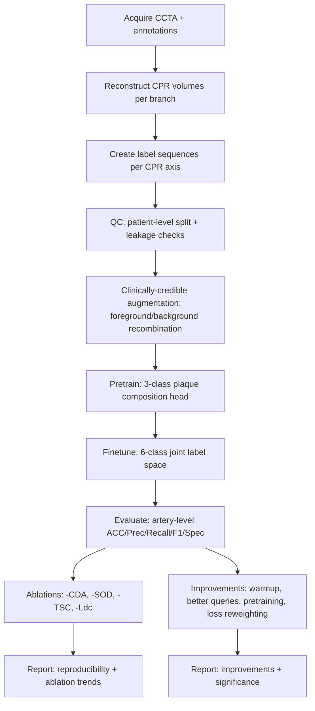
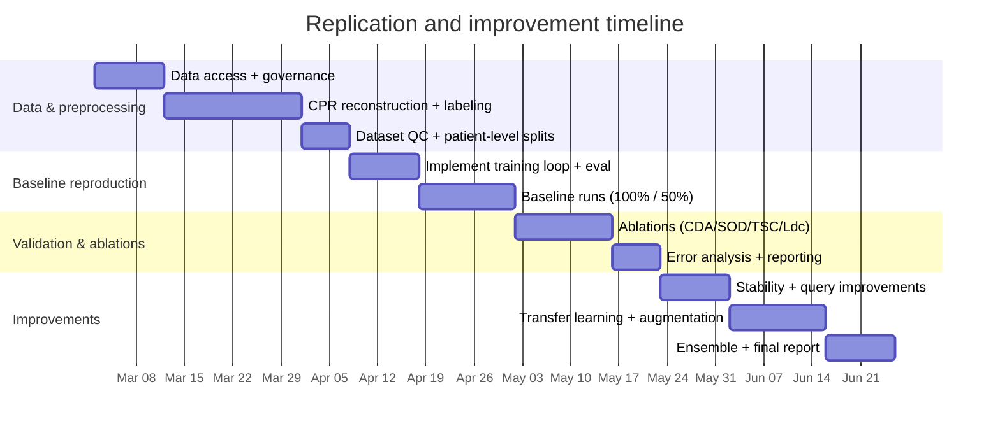

# Replicating and Improving SC-Net for Data-Efficient CAD Diagnosis in CCTA

## Executive summary

This report distills and operationalizes the fileciteturn0file0 paper “Spatio-temporal Contrast Network (SC-Net) for Data-efficient Learning of Coronary Artery Disease in Coronary CT Angiography,” which proposes a three-part strategy for data-scarce coronary artery disease (CAD) diagnosis from CCTA-derived curved planar reformations (CPR): clinically credible lesion recombination augmentation, spatio-temporal dual-task learning (object detection + sampling-point classification), and dual-task prediction-contrast to reduce missed/misdiagnosis under limited labels. citeturn8view0turn11view0turn9view4

The key replication bottleneck is data: the MICCAI open-access listing states no dataset link is available, implying the clinical dataset described in the paper is not publicly released. citeturn1view1 Therefore, “match the paper” in practice means (a) reproducing the *pipeline and objective* exactly, and (b) validating that your dataset’s labeling semantics (stenosis degree + plaque type) can be represented in the same CPR/sequence format the authors use. citeturn10view0turn15view0turn15view1

A pragmatic, highest-leverage plan is:

1) **Lock down data representation and splits** (patient-level split; CPR volume geometry; label-to-box conversion; quality control). citeturn9view1turn15view0turn10view0  
2) **Reproduce SC-Net “as-is”** using the open-access PDF + the released repository (including their label/box transforms used for the dual-task contrast). citeturn8view0turn15view0turn3view1  
3) **Run a small set of “must-have” ablations** (remove CDA, remove each task, remove dual-task contrast) and confirm qualitative trends match the paper. citeturn9view4turn8view0  
4) **Prioritize improvements that increase convergence stability and sample efficiency** without changing the target task: (i) stabilize the DETR-like matching/contrast loop (warm-up schedules, detach options, loss weighting), (ii) better initialization/pretraining (Med3D/MedicalNet), and (iii) stronger—but still clinically plausible—augmentations and domain generalization. citeturn5academia33turn5academia32turn13search3turn13search7turn15view0

## Paper distillation

### Problem framing and objective

SC-Net targets **automated CAD diagnosis from CCTA** under **scarce annotated data**, emphasizing that limited labels worsen imbalance between healthy and lesion regions and can increase generalization errors in single-task approaches. citeturn8view0turn9view0 The stated goal is **clinically reliable lesion assessment despite limited training samples**, using augmentation + spatio-temporal feature learning + dual-task prediction-contrast. citeturn8view0turn9view4

### Dataset, outputs, and reported results

The paper describes clinical CCTA scans from **218 patients** (mean age 57.4 ± 6.2; 163 males; 2019–2022). citeturn9view0 From these scans, **1163 CPR volumes** of main coronary branches were reconstructed; **994 coronary lesions** were annotated, comprising **678 non-significant stenoses** (208 calcified, 119 non-calcified, 351 mixed) and **316 significant stenoses** (107 calcified, 94 non-calcified, 115 mixed). citeturn10view0

Metrics are reported at the artery-level: ACC, precision, recall, F1, and specificity (Spec). citeturn9view1 The main quantitative comparison (reporting 50%/100% data volume) shows SC-Net outperforming prior methods for stenosis and also outperforming plaque-capable baselines for plaque characterization. citeturn9view0turn9view4

### Method summary

SC-Net consists of three components. citeturn8view0turn9view4

**Clinically-credible data augmentation (CDA).** Lesion ROIs (“foreground”) are overlaid onto background CPR volumes to create an augmented set A: \(a = (b - b_I) \cup f_I\). citeturn8view0turn9view3 Training uses **pretraining on augmented A** (plaque composition only) followed by **fine-tuning on clinical B** (plaque composition + stenosis degree). citeturn9view3turn15view0turn15view1

**Spatio-temporal semantic learning.** Spatial semantics are learned via object detection on a CPR volume plus four primary 2D views (sagittal, coronal, and two diagonals), followed by a Transformer queried by Q embeddings; temporal semantics are learned via sampling-point classification across a sequence of 3D cubes with a Transformer encoder for inter-location correlation. citeturn8view0turn9view1

**Dual-task contrastive optimization.** Total loss is \(L = L_{od} + L_{sc} + L_{dc}\), where \(L_{dc}\) uses each task’s predictions as pseudo-ground-truth for the other through transforms \(C(\cdot)\) and \(C^{-1}(\cdot)\). citeturn11view0 The object detection loss uses bipartite matching via the Hungarian algorithm, consistent with DETR-style training. citeturn11view0turn5academia33turn12search3

### Implementation-specific details (paper + released repository)

The paper specifies: CPR volume input 256×64×64; 2D views 256×64; 32 cubes per CPR volume with interval 8 and cube size 25³; Q=16 queries; IoU/L1 weights λ_iou=2 and λ_L1=5; and 70% train / 30% val+test with best checkpoint selected after 200 epochs. citeturn9view1turn10view0

The released code repository states requirements: Python 3.9, PyTorch 1.12, torchvision, einops, nibabel, numpy, scipy. citeturn1view0turn4view0 The repository encodes key operational choices outside the paper, including CT windowing parameters, on-disk dataset structure, and explicit definitions for the transforms between detection and sampling-point targets used in dual-task contrast. citeturn15view0turn3view1turn16view0

#### Concise extraction table

| Element | What the paper/code specifies | Key values / description | What is unspecified or ambiguous (must decide/verify) |
|---|---|---|---|
| Objective | Data-efficient CAD diagnosis from CCTA CPR with reliable lesion assessment | Three designs: CDA + spatio-temporal dual-task + prediction-contrast | Clinical labeling policy for “artery-level” aggregation beyond brief description citeturn8view0turn9view4 |
| Dataset | 218 patients; 1163 CPR volumes; lesion counts and plaque types | Non-significant vs significant stenosis; calcified/non-calcified/mixed | Raw CCTA acquisition parameters; CPR reconstruction exact pipeline; dataset access (not shared) citeturn9view0turn10view0turn1view1 |
| Preprocessing | CPR volume + 4 2D views; 32 cubes | Size 256×64×64; cubes 25³, step 8 | Exact resampling resolution / spacing policy; intensity normalization details in paper (code uses HU clipping + scaling) citeturn9view1turn16view0turn15view0 |
| Architecture | 3D+2D feature extraction; Transformer queries for detection; Transformer encoder for cube sequence | Q=16; embeddings 512-dim (paper) | Exact CNN block topology in paper; code’s query construction differs from canonical DETR (random indices) citeturn9view1turn15view2turn5academia33 |
| Training regimen | Pretrain on augmented A (plaque composition), fine-tune on clinical B | 200 epochs; best val checkpoint | Optimizer, LR schedule, weight decay, dropout schedule (not clearly specified in paper; not provided as a training script) citeturn9view1turn15view1 |
| Loss functions | DETR-like matching + L1/IoU; cross-entropy; dual-task contrast | Hungarian matching; \(L = L_{od}+L_{sc}+L_{dc}\) | Exact λ weights interplay: paper states λ_iou=2, λ_L1=5; code’s implemented weights differ—must reconcile experimentally citeturn11view0turn3view1turn10view0 |
| Evaluation | ACC, Prec, Recall, F1, Spec at artery-level for stenosis and plaque | Table 1 gives 50%/100% metrics | Precise artery-level aggregation rule (segment→artery), tie-breaking, thresholding, and per-class averaging citeturn9view0turn9view1 |
| Ablations | CDA, spatial OD (SOD), temporal sampling-point classification (TSC), dual-task contrast loss Ldc | Removing each reduces performance | Numeric ablation values not fully enumerated in text; must reproduce from re-implementation citeturn9view4 |

image_group{"layout":"carousel","aspect_ratio":"16:9","query":["coronary CT angiography curved planar reformation CPR example","coronary artery plaque CCTA example","DETR transformer object detection architecture diagram","Hungarian matching DETR diagram"],"num_per_query":1}

## Reproduction checklist

This section is written as an execution-ready checklist, aligned to what is concretely described in the paper and what is concretely implemented in the released code.

### Data access and labeling prerequisites

Because the paper’s clinical dataset is not publicly linked, you must supply an equivalent dataset and annotations (or obtain access via collaboration/IRB). citeturn1view1turn9view0 Your dataset must support:

- **Patient-level CCTA scans** with identifiable coronary artery branches and contrast-enhanced lumen suitable for CPR reconstruction (the paper’s clinical context). citeturn9view0turn8view0  
- **CPR volumes per coronary branch** (the paper reports 1163 CPR volumes for main branches). citeturn10view0turn8view0  
- **Per-position labels along the CPR centerline axis** that can be converted into contiguous “lesion intervals” (the code converts a 1D label sequence into normalized interval “boxes,” and uses those both for detection targets and for cross-task transforms). citeturn15view0turn3view1  
- **A labeling ontology compatible with two-stage training**: pretraining uses 3-class labels derived from the fine-tuning label space via a modulo mapping (code maps labels >0 to 1–3 for augmentation outputs), strongly implying “plaque type only” pretrain vs “plaque type × stenosis degree” fine-tune. citeturn15view0turn15view1turn10view0

### Repository, environment, and dependency lock

The code is hosted on entity["company","GitHub","code hosting platform"] and lists Python 3.9 and entity["organization","PyTorch","deep learning framework"] 1.12 plus standard scientific packages (einops, nibabel, numpy, scipy, torchvision). citeturn1view0turn4view0

A minimal reproducible environment definition (example):

```bash
# Example (conda)
conda create -n scnet python=3.9 -y
conda activate scnet

# Install PyTorch 1.12.* matching your CUDA
pip install torch==1.12.1 torchvision==0.13.1 --extra-index-url https://download.pytorch.org/whl/cu116

pip install einops nibabel numpy scipy
```

The paper itself does not specify CUDA/cuDNN versions; lock these in your experiment log to avoid silent drift. citeturn9view1turn5search3

### Required code modules and what each must implement

The repository exposes the functional “minimum” you need even if you rewrite the training script:

- **augmentation.py**: clinically credible augmentation generation; dataset class that reads NIfTI volumes and label text files; CT windowing and normalization; label→interval conversion for detection targets. citeturn15view0turn16view0  
- **architecture.py**: spatio-temporal semantic learning model class and two task heads. citeturn15view2  
- **optimization.py**: object detection loss (with GIoU-style term), sampling-point classification loss, and dual-task contrastive loss using explicit transforms between task spaces. citeturn3view1turn6search1turn5academia33  
- **functions.py**: CT normalization; cube sampling policy; Hungarian matcher implementation; generalized IoU utilities. citeturn16view0turn6search1turn12search3  
- **config.py**: canonical input shapes and hyperparameters such as batch size, eos coefficient, train_ratio, and CT window. citeturn3view0  
- **framework.py**: wiring for “pre_training” vs “fine_tuning” configurations (not a full training loop). citeturn15view1

### Hardware and runtime envelope

The released configuration uses **input volumes 256×64×64** and **batch size 2**, which is consistent with modest-GPU feasibility but still involves 3D convolutions and Transformers. citeturn3view0turn9view1turn15view2 A conservative replication target is:

- **Low**: 1× 24GB GPU (or better), ~16 CPU cores for preprocessing, SSD storage. (Engineering estimate based on tensor sizes + batch size in config; not stated in paper.) citeturn3view0turn9view1  
- **Medium**: 2–4× GPUs to run multi-seed and small sweeps. (Engineering estimate.)  
- **High**: 8× GPUs if adding self-supervised pretraining or large sweeps. (Engineering estimate.)

### Step-by-step reproduction checklist

| Step | Exact action | Pass/fail criterion | Source alignment |
|---|---|---|---|
| Data split | Implement **patient-level** split: train/val/test with **70% train** per paper; also test **80% train** to match repo default | No patient appears in multiple splits; you can reproduce both split ratios | Paper’s 70% split vs repo’s train_ratio=0.8 citeturn9view1turn3view0turn15view0 |
| CPR formatting | Ensure each CPR volume is shaped/serialized to match 256×64×64; record resampling method | Dataset loader reads without shape errors; consistent axis convention | Input shapes per paper and config citeturn9view1turn3view0turn15view0 |
| Label semantics | Define label IDs so that contiguous segments map to lesion intervals; confirm mod-3 mapping yields plaque-only labels for pretraining | Round-trip tests: label→boxes→label is stable for synthetic cases | Code defines label→boxes and cross-task transforms citeturn15view0turn3view1 |
| CT normalization | Implement HU clipping/windowing and normalize to [0,1] (as code) | Min/max after preprocessing match expected | Code’s `normalize_ct_data` policy citeturn15view0turn16view0 |
| Augmentation A | Generate augmented dataset A by overlaying lesion foreground onto background; verify output NIfTI + label writing | Augmented samples exist + load; lesion segments present | Paper’s CDA concept and code’s generator citeturn9view3turn15view0 |
| Pretrain | Pretrain using 3-class head on augmented A (plaque composition), save checkpoint | Training loss decreases; val metrics stabilize; checkpoint loads into fine-tune model | Paper’s pretrain→fine-tune pipeline + code framework citeturn9view3turn15view1 |
| Fine-tune | Fine-tune using 6-class head on clinical B; select best val checkpoint over 200 epochs (or replicate best-at-200 protocol) | Best checkpoint achieves comparable metrics to paper’s Table 1 on your dataset (or on their data if you have access) | Paper’s 200-epoch selection, Table 1 targets citeturn9view1turn9view0 |
| 50% vs 100% | Train with 50% and 100% of labeled training data; keep test fixed | SC-Net retains performance under 50% comparable to strong baselines at 100% (trend) | Paper’s “50%/100%” comparison citeturn9view0turn9view4 |
| Regression tests | Unit-test Hungarian matching path, C/C⁻¹ transforms, and empty-target cases | No crashes; loss finite for empty-lesion samples | Paper + repo implement Hungarian matching and transforms citeturn11view0turn3view1turn16view0 |

## Experimental plan

This experimental plan is prioritized to (a) replicate the reported behavior and (b) improve beyond it while keeping comparability.

### Baseline reproduction track

**Baseline target metrics (from the paper).** For stenosis-degree classification at artery-level, SC-Net reports (50%/100% data): ACC 0.914/0.928, Prec 0.939/0.942, Recall 0.939/0.946, F1 0.938/0.944, Spec 0.861/0.879. citeturn9view0 For plaque-component evaluation (only methods that output plaques), SC-Net reports (50%/100%): ACC 0.903/0.912, Prec 0.936/0.941, Recall 0.934/0.939, F1 0.935/0.940, Spec 0.784/0.816. citeturn9view0

**Success criteria for replication.** If you have the same data: match each metric within ±1–2 percentage points across ≥3 random seeds (engineering tolerance; not specified in paper). If you have different data: match *relative trends* (SC-Net > strong baselines; 50% SC-Net comparable to 100% baselines). citeturn9view4turn9view0

### Hyperparameter search space

The paper concretely specifies only a few hyperparameters; the released config supplies additional ones. citeturn9view1turn3view0 You should run a **bounded search** that prioritizes stability-impactful knobs first:

| Parameter | Baseline | Search range | Rationale / notes |
|---|---|---|---|
| Learning rate | Not specified | log-uniform [1e-5, 3e-4] | Optimizer not defined in paper; DETR-like losses can be sensitive citeturn11view0turn5academia33 |
| Optimizer | Not specified | AdamW vs Adam | DETR commonly uses AdamW; verify against your implementation (method reference) citeturn5academia33 |
| Weight decay | Not specified | {1e-4, 5e-4, 1e-3} | Regularization under low data citeturn8view0 |
| eos_coef (no-object weight) | 0.2 (code) | {0.05, 0.1, 0.2, 0.4} | Controls dominance of “no lesion” in matching/classification citeturn3view0turn3view1 |
| Dual-task contrast weight δ | 1 (code default) | ramp schedule 0→1; {0.25, 0.5, 1, 2} | Stabilize training: early pseudo-labeling may be noisy citeturn3view1turn9view4 |
| Query count Q | 16 | {8, 16, 32} | Paper assumes ≤16 lesions per segment; validate on your data distribution citeturn9view1turn15view2 |
| λ_L1, λ_IoU | 5, 2 (paper) | around paper values; also match code weights | Paper values differ from repository’s unweighted implementation; test both paths citeturn9view1turn3view1turn11view0 |
| CT window (level/width) | [300,900] (code) | small clinical variations | Sensitivity to scanner/protocol; must stay clinically plausible citeturn3view0turn15view0turn6search4 |

### Ablation experiments

The paper’s ablations remove: CDA, spatial object detection (SOD), temporal sampling-point classification (TSC), and the dual-task contrastive loss \(L_{dc}\), reporting that each removal harms performance (especially under smaller training sets). citeturn9view4

To reproduce these conclusions, implement:

- **No-CDA**: train fine-tune model without any pretraining on augmented A and/or without using CDA-generated samples. citeturn9view4turn9view3  
- **No-SOD**: drop the object detection branch; train only sampling-point classification (temporal). citeturn9view4turn8view0  
- **No-TSC**: drop sampling-point classification; train only object detection (spatial). citeturn9view4turn8view0  
- **No-Ldc**: remove the mutual-supervision term; keep task losses only. citeturn9view4turn11view0

### Beyond-replication improvement experiments

These experiments are designed to improve sample efficiency, robustness, and convergence stability while keeping evaluation compatible with the paper’s metrics.

#### Experiment comparison table

Compute/time values below are engineering estimates expressed in **single-GPU hours** for one full train+val run (scaled linearly for multi-seed). They depend heavily on GPU class, I/O, and dataset size; the paper does not provide wall-clock timing. citeturn9view1turn3view0

| ID | Priority | Experiment | Expected impact | Success criteria | Est. compute/time |
|---|---:|---|---|---|---|
| E0 | P0 | **Exact-pipeline reproduction** (match preprocessing, label→box, losses, 200-epoch best-val selection) | Enables meaningful comparisons; should replicate trends in Table 1 | Metrics within tolerance or trend match | 1 run: ~6–30 GPU-hr (estimate) |
| E1 | P0 | **Dual-task contrast warm-up**: start δ=0, linearly ramp to 1 over first 10–30 epochs; optionally detach pseudo-targets early | Stabilizes training when pseudo-labels are poor early | +0.5–2 pts F1/Spec or reduced variance across seeds | +0–10% runtime |
| E2 | P0 | **Fix/regularize query embeddings**: replace per-forward random query indices with learned fixed queries (DETR-style) | Less gradient noise; more stable detection head | Better convergence; improved localization consistency | negligible |
| E3 | P1 | **DN-DETR-style denoising training** adapted to 1D intervals (inject noisy GT intervals into decoder as auxiliary supervision) | Faster convergence, better under low data | Same accuracy in fewer epochs or +1 pt F1 | +10–20% runtime citeturn5academia32turn5academia33 |
| E4 | P1 | **Med3D/MedicalNet initialization** for 3D conv blocks (pretrained weights) | Better representation under low data | +1–3 pts across metrics; fewer epochs to peak | 0 (if weights available) citeturn13search3turn13search7 |
| E5 | P1 | **Loss rebalancing for class imbalance**: focal loss on classification heads or class-weighted CE | Better minority lesion detection (recall/spec) | Improve recall/spec at fixed precision | negligible–small citeturn17search0turn9view0 |
| E6 | P1 | **Augmentation expansion (clinically plausible)**: HU jitter within window, noise, blur, mild streak artifacts; keep CDA | Better generalization across scanners/protocols | Improved test metrics without harming calibration | +0–10% runtime citeturn6search4turn15view0 |
| E7 | P2 | **Ensembling**: 3–5 seed ensemble or snapshot ensemble | Often improves F1/spec and reduces variance | +0.5–1.5 pts; tighter CI | ×3–5 run cost |
| E8 | P2 | **DETR convergence accelerators**: Deformable DETR / Conditional DETR concepts adapted to 1D attention | Potential large convergence gains | Reach same metrics with fewer epochs | Medium engineering effort citeturn17search1turn17search2 |

### Mermaid experiment workflow



## Diagnostics and validation

### What to monitor during training

Because SC-Net couples two tasks with mutual supervision, you need step-level diagnostics that can detect *self-reinforcing failure*. citeturn11view0turn3view1 Monitor:

- **Separate loss curves**: \(L_{od}\), \(L_{sc}\), \(L_{dc}\), plus per-component terms (CE, L1, GIoU). citeturn11view0turn3view1turn6search1  
- **Match quality diagnostics**: number of GT intervals per sample, Hungarian match cost statistics, fraction of “no-object” predictions. (DETR-style matching is known to be sensitive early; see DETR’s bipartite matching formulation.) citeturn5academia33turn11view0turn16view0  
- **Class distribution drift** between train/val/test and between augmented A vs clinical B, since CDA explicitly changes the mixture of lesion contexts. citeturn9view3turn15view0turn10view0

### Visualizations that catch the most bugs

Use visual checks tied to the actual representation in SC-Net:

- **1D timeline plots per CPR**: ground-truth label sequence vs predicted sampling-point class argmax, plus predicted detection intervals projected back into the sequence space using the same transforms used in \(L_{dc}\). citeturn3view1turn15view0turn11view0  
- **Overlay predicted lesion intervals on CPR slices**: even though the “boxes” are 1D intervals, render start/end along the CPR axis on the 3D volume to validate anatomical plausibility. citeturn15view0turn10view0turn8view0  
- **Error stratification by plaque type and stenosis degree** using the lesion breakdown reported in the paper (calcified/non-calcified/mixed; significant vs non-significant). citeturn10view0turn9view0

### Unit tests and invariants

These tests prevent silent correctness errors (common in medical pipelines):

- **Label↔interval round-trip correctness**: `labels_data -> detection_targets(boxes) -> od2sc_targets -> sc2od_targets` should be stable under simple synthetic sequences, acknowledging that discretization/rounding can break perfect invertibility. citeturn15view0turn3view1turn1view1  
- **Bounds checks**: all predicted and target interval endpoints must lie in [0,1] before sigmoid/after normalization; all indices after discretization must be within [0, seq_len-1]. citeturn3view1turn15view0  
- **Empty-lesion handling**: verify that samples with zero lesions do not crash Hungarian matching or loss computations (the repository includes explicit empty-target branches). citeturn3view1turn16view0

### Common failure modes (and the quickest fixes)

- **Leakage via CPR splits**: if you split by CPR-volume rather than patient, the same patient can leak across splits, inflating metrics. Patient-level split is implied by “CCTA scans split” in the paper. citeturn9view1turn9view0  
- **Unstable mutual supervision early**: \(L_{dc}\) can amplify early mistakes when both heads are weak; ramping δ or detaching pseudo-targets for early epochs is a high-return stabilization. citeturn11view0turn3view1  
- **Mismatch between paper math and code semantics**: the paper describes ROI parameterization as center+width, but the released code operationalizes ROIs as 1D intervals in the sequence domain and reuses GIoU utilities via dimension expansion; treat the **repository as the executable specification** and validate behaviors empirically. citeturn11view0turn3view1turn16view0  

## Optimization and scaling

### Mixed precision and throughput

Use AMP to reduce memory and increase throughput; PyTorch documents that AMP uses autocast (lower precision where safe) and gradient scaling to prevent underflow. citeturn5search2turn5search5 For SC-Net, AMP is typically safe because the model is conv/Transformer heavy, but you should keep loss computations in float32 where needed (engineering best practice). citeturn5search2turn5search14

### Distributed training

If you move beyond single-GPU, prefer `torch.nn.parallel.DistributedDataParallel` (DDP), which PyTorch states is significantly faster than `DataParallel` for multi-GPU training. citeturn14search0turn14search3 For SC-Net, the biggest multi-GPU gains come from multi-seed evaluation and parallel sweeps rather than model-parallel scale (engineering assessment based on model size implied by config). citeturn3view0turn15view2

### Checkpointing and resumability

PyTorch recommends saving more than model weights when resuming training—specifically optimizer state and training progress metadata. citeturn14search1turn9view1 This is particularly important for SC-Net because the best checkpoint is chosen by validation performance across many epochs. citeturn9view1

For memory-limited setups, consider activation checkpointing; PyTorch documents the compute/memory tradeoff and notes RNG-state handling for determinism. citeturn14search2turn5search3

### Reproducibility practices and CI

PyTorch’s reproducibility notes emphasize controlling randomness and avoiding nondeterministic kernels (e.g., via `torch.use_deterministic_algorithms`). citeturn5search3turn5search12 For SC-Net, reproducibility is especially sensitive because CDA sampling and dual-task pseudo-targets introduce additional stochasticity. citeturn15view0turn3view1

A lightweight CI plan is to run: (a) dataset load + one forward + one backward step on a tiny synthetic batch, and (b) unit tests around transforms and bounds, ensuring all losses are finite and gradients propagate. citeturn3view1turn16view0turn11view0

## Risk assessment and ethical considerations

### Data privacy and governance

CCTA data is inherently sensitive, and its handling typically falls under health-data privacy regimes depending on jurisdiction and organizational role.

- In the US, the entity["organization","U.S. Department of Health & Human Services","federal health agency"] describes the HIPAA Privacy Rule as establishing national standards to protect individuals’ medical records and other individually identifiable health information (“PHI”). citeturn7search0turn7search4  
- In the EU, the entity["organization","European Commission","eu executive body"]–published GDPR defines personal data broadly as information relating to an identified or identifiable natural person. citeturn7search17turn7search29  
- In Singapore, the entity["organization","Personal Data Protection Commission","singapore privacy regulator"] publishes advisory guidelines on key PDPA concepts relevant to “personal data,” which can apply to medical datasets used in model training. citeturn7search6turn7search2  

Operationally, this implies: minimize identifiers, strictly control access, maintain audit logs, document data lineage, and ensure your consent/IRB/DUA basis is valid for both training and downstream evaluation. (Policy application varies; consult your compliance office.) citeturn7search0turn7search10turn7search17

### Clinical safety, evaluation integrity, and regulatory orientation

If the model’s outputs could influence patient care, align development with recognized good-practice principles for medical AI/ML. The entity["organization","U.S. Food and Drug Administration","us medical device regulator"] highlights Good Machine Learning Practice (GMLP) guiding principles and references the entity["organization","International Medical Device Regulators Forum","medical device regulators forum"] final GMLP document. citeturn7search3turn7search11turn7search7

SC-Net’s design explicitly relies on clinically motivated assumptions (e.g., plaque appearance in CT and stenosis interpretation context); the paper cites guidance from the Society of Cardiovascular Computed Tomography. citeturn9view3turn6search4 (You should validate that your augmentation remains clinically plausible and does not synthesize anatomically impossible patterns.)

### Bias and representativeness risk

The described dataset is majority male (163/218), which may reduce generalizability if sex-specific differences or referral patterns affect appearance distributions in CCTA. citeturn9view0 A minimum ethical bar is to stratify performance across demographics available to you (sex, age bands, scanner type, acquisition protocol) and report uncertainty intervals rather than single-point estimates. citeturn9view1turn5search3

## Deliverables, timeline, and resource budget options

### Deliverables

A replication-and-improvement project is complete when it produces:

- A fully versioned codebase that rebuilds the CPR dataset representation, runs training end-to-end, and reproduces the paper’s core SC-Net behaviors (including ablation trends). citeturn9view4turn15view0turn15view1  
- A “repro pack” including environment lock (exact package versions), seeds, split manifests, preprocessing parameters (CT windowing, resampling), and model checkpoints for best-val runs. citeturn5search3turn14search1turn3view0  
- An experiment report containing: baseline reproduction vs Table 1 targets, ablation results, selected improvements (with statistical stability across seeds), and qualitative error review examples. citeturn9view0turn9view4turn8view0  

### Budget options table

| Budget | Suggested hardware | Scope of experiments | Typical timeline (engineering estimate) |
|---|---|---|---|
| Low | 1× single GPU (≥16–24GB), CPU workstation | Baseline + 4 ablations + 1–2 improvements (E1/E2) | 3–5 weeks |
| Medium | 2–4× GPUs (or cloud equivalents) | Baseline + ablations + bounded hyperparam search + 3–5 improvements | 5–8 weeks |
| High | 8× GPUs + fast shared storage | Multi-seed sweeps + pretraining + ensemble + stronger DETR accelerators | 8–12+ weeks |

All time estimates assume data access and CPR reconstruction tooling are available; if CPR generation and labeling must be built from scratch, add an additional preprocessing workstream. citeturn10view0turn5search0turn12search26

### Mermaid timeline



