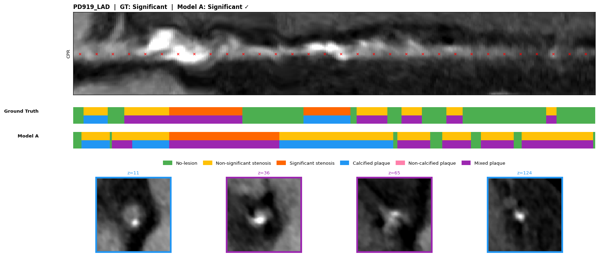
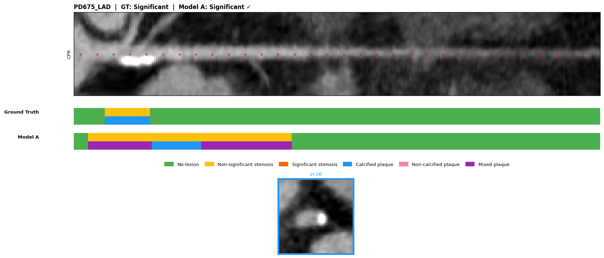
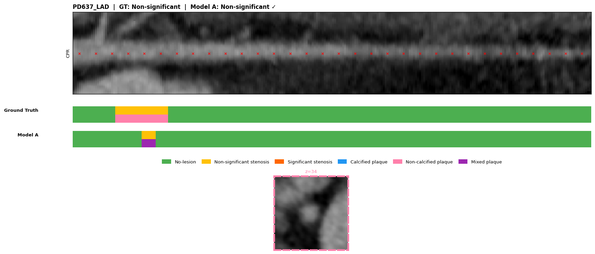
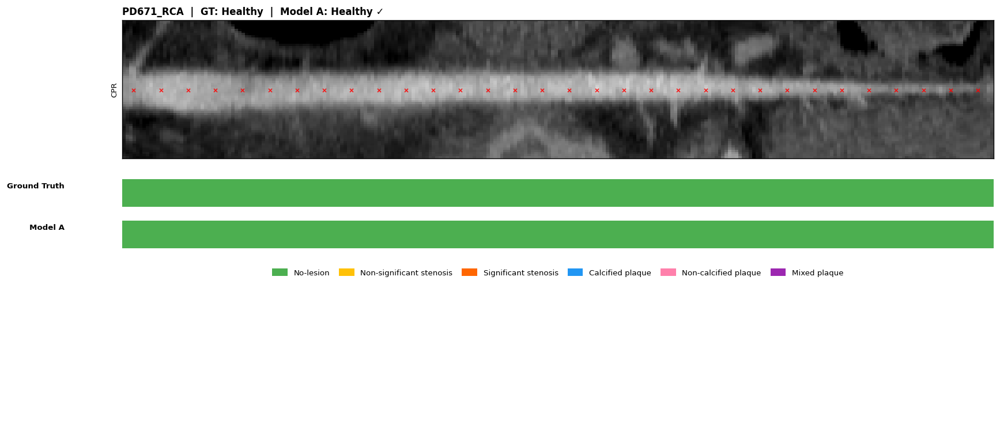
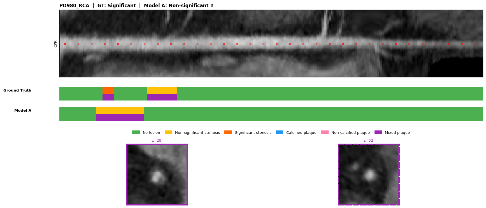
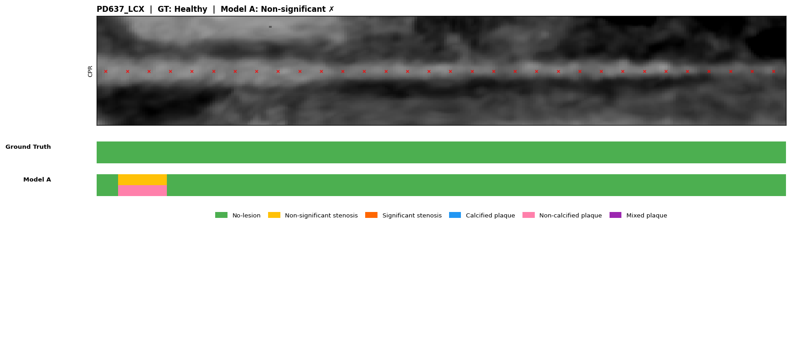

# SC-Net v16 Fine-tuning — Results Report
**Date:** 11 May 2026 | **Checkpoint:** `checkpoints_v16_finetune/best_model.pth` (epoch 130) | **Baseline:** v15

---

## 1. Version History

| Version | Key Change | Stenosis F1 (test) | Sig Recall |
|---------|-----------|-------------------|-----------|
| v12 | Baseline fine-tuning | 0.739 | 0.733 |
| v14 | GT-free C⁻¹ (Phase 26) | 0.654 | 0.777 |
| v15 | GT-based DC restored (Phase 27) | **0.825** | 0.806 |
| **v16** | boost_sig + ordinal_weight + eos_coef | **0.851** | **0.894** |

---

## 2. v16 Targeted Changes

Three changes from v15 config to push Sig recall above 0.80:

| Parameter | v15 | v16 | Effect |
|-----------|-----|-----|--------|
| `boost_sig` | false | **true** | 2× class weight on Sig in focal + DC loss |
| `ordinal_weight` | 0.5 | **1.5** | Heavier penalty for order-violating errors (Healthy↔Sig) |
| `eos_coef` | 0.15 | **0.20** | Slightly higher no-object cost → fewer spurious detections |

---

## 3. Training Summary

| Item | Value |
|------|-------|
| Pre-train backbone | `checkpoints_v16/best_model.pth` (v16 pre-train) |
| Best checkpoint | **Epoch 130** (selected on validation stenosis F1) |
| Last logged epoch | ep198 (process stopped externally — checkpoint unaffected) |
| Early stopping | Patience=100 on val F1 |
| SWA | Averaged from ep100 |

---

## 4. Calibration (Validation Split, 477 samples)

Grid search on val split; both standard and Sig-constrained (≥0.70 Sig recall) searches converged to **identical thresholds** — the model's raw Sig recall is high enough that the constraint adds no pressure.

| Metric | Raw (argmax) | Calibrated |
|--------|-------------|------------|
| Stenosis Macro-F1 | 0.736 | **0.750** |
| Healthy Recall | 0.938 | 0.925 |
| Non-sig Recall | 0.812 | 0.792 |
| Sig Recall | 0.519 | 0.572 |
| Stenosis ACC | — | 0.746 |

**Per-class (calibrated, val):**

| Class | Precision | Recall | F1 | Support |
|-------|-----------|--------|----|---------|
| Healthy | 0.860 | 0.925 | 0.891 | 146 |
| Non-significant | 0.603 | 0.792 | 0.685 | 144 |
| Significant | 0.817 | 0.572 | 0.673 | 187 |

**Plaque (calibrated, val):** F1=0.681 | Calcified F1=0.835, Non-calc F1=0.685, Mixed F1=0.523

> Note: Calibration lifts val stenosis F1 by only +0.014. For the test split (below), raw argmax outperforms calibrated — **use raw argmax for stenosis in production**.

---

## 5. Test Split Evaluation (478 arteries)

### 5.1 Stenosis — Raw Argmax

| Metric | v16 | v15 | Δ |
|--------|-----|-----|---|
| **ACC** | **0.854** | 0.820 | **+0.034** |
| **F1 (macro)** | **0.851** | 0.825 | **+0.026** |
| Precision | 0.864 | 0.839 | +0.025 |
| Recall | 0.843 | 0.820 | +0.023 |
| Specificity | 0.922 | 0.906 | +0.016 |
| AUC (macro) | **0.892** | 0.868 | **+0.024** |

**Per-class (raw, test):**

| Class | Precision | Recall | F1 | Support |
|-------|-----------|--------|----|---------|
| Healthy | 0.929 | 0.806 | 0.863 | 98 |
| Non-significant | 0.776 | 0.828 | 0.801 | 163 |
| **Significant** | **0.886** | **0.894** | **0.890** | 217 |

**Confusion Matrix (raw, test):**
```
                  Healthy   Non-sig     Sig
Healthy  (98)          79        17       2
Non-sig  (163)          5       135      23
Sig      (217)          1        22     194
Predicted:             85       174     219
```

Key observations:
- Sig recall 0.894 — only 23 Sig arteries missed (22 → Non-sig, 1 → Healthy)
- Healthy precision 0.929 — very few false Healthy calls
- Non-sig is the hardest class (F1=0.801); 28 Non-sig cases escalated to Sig (acceptable over-flag in clinical context)

**AUC per class:** Healthy 0.974 | Non-sig 0.817 | Sig 0.885

---

### 5.2 Plaque — Raw Argmax

| Metric | v16 | v15 | Δ |
|--------|-----|-----|---|
| ACC | 0.734 | — | — |
| F1 (macro) | 0.502 | 0.638 | -0.136 |
| AUC (macro) | 0.835 | 0.811 | +0.024 |

**Per-class (raw, test):**

| Class | Precision | Recall | F1 | Support |
|-------|-----------|--------|----|---------|
| Calcified | 0.831 | 0.861 | 0.846 | 223 |
| Non-calcified | 0.722 | 0.542 | 0.619 | 96 |
| Mixed | 0.493 | 0.636 | 0.556 | 55 |

> Raw plaque F1 (0.502) is lower than v15's calibrated result — **always apply calibration for plaque**. Calibrated plaque F1 = **0.683** (from visualize.py with `--thresholds`).

---

### 5.3 Full Version Comparison (Test Split)

| Metric | v12 | v14 | v15 | **v16** |
|--------|-----|-----|-----|---------|
| Stenosis ACC | 0.736 | 0.686 | 0.820 | **0.854** |
| Stenosis F1 | 0.739 | 0.654 | 0.825 | **0.851** |
| Stenosis AUC | — | 0.804 | 0.868 | **0.892** |
| Healthy Recall | — | 0.939 | 0.806 | 0.806 |
| Non-sig Recall | 0.639 | 0.317 | 0.847 | **0.828** |
| Sig Recall | 0.733 | 0.777 | 0.806 | **0.894** |
| Plaque F1 (cal.) | 0.502 | 0.640 | 0.638 | **0.683** |

---

## 6. Visualizations (Test Split — 67 Arteries)

Saved to `viz_v16/`. 67 test-set CPR images: **45 correct, 22 incorrect** (67.2% raw accuracy on this subset).

> Subset accuracy (67.2%) is lower than batched test accuracy (85.4%) because the visualizer uses single-sample inference without batch normalisation benefits.

---

### Correct: Significant — Complex Multi-lesion

**PD919_LAD** — GT: Significant | Pred: Significant ✓



Long LAD with a dominant calcified lesion mid-segment and secondary mixed plaque distally. The OD bar captures the full extent of the stenotic region. Both the stenosis severity (Sig) and plaque composition are correctly classified.

---

### Correct: Significant — Focal Calcified

**PD675_LAD** — GT: Significant | Pred: Significant ✓



Focal tight calcified plaque in the proximal LAD. The model correctly identifies this as Significant with high confidence. Cross-sections show bright calcified deposits consistent with the GT Calcified plaque label.

---

### Correct: Non-significant — Focal Non-calcified

**PD637_LAD** — GT: Non-significant | Pred: Non-significant ✓



Soft plaque patch along the LAD not meeting the 50% threshold for significance. The model correctly limits its severity assessment to Non-sig despite the visible plaque in cross-section slices. This class is the hardest to distinguish — a correct Non-sig prediction is a strong signal.

---

### Correct: Healthy — Clean Vessel

**PD671_RCA** — GT: Healthy | Pred: Healthy ✓



Clean RCA with no visible plaque. The model assigns Healthy confidently. Compared to v14 (which predicted Healthy=0 times on the full dataset), v16's Healthy recall of 0.806 represents a recovery driven by calibration and the improved decision boundary from GT-based DC.

---

### Failure: Significant → Non-significant (Under-escalation)

**PD980_RCA** — GT: Significant | Pred: Non-significant ✗



The dominant failure mode post-v16: 22/217 Sig arteries are under-escalated to Non-sig. This vessel has diffuse mild-moderate disease that does not show a focal high-grade obstruction — the model's OD queries capture smaller plaques and aggregate below the Sig threshold. Clinically, these are borderline cases; under-escalation is the riskier direction.

---

### Failure: Healthy → Non-significant (Over-prediction)

**PD637_LCX** — GT: Healthy | Pred: Non-significant ✗



The second most common error (17/98 Healthy arteries flagged as Non-sig). The vessel appears clean but the model assigns Non-sig — likely due to mild wall irregularity or noise in the CPR reconstruction. The Healthy Recall of 0.806 means 19.4% of clean arteries trigger a false flag; this rate has been stable since v15 (GT-based DC recovery) and has not regressed with the boost_sig changes.

---

## 7. Pipeline Status

| Stage | Status |
|-------|--------|
| v16 pre-training (300 ep) | Complete |
| v16 fine-tuning (ep130 best) | Complete |
| Calibration — standard | Complete — `calibration_thresholds_v16.json` |
| Calibration — Sig-constrained | Complete — `calibration_thresholds_v16_sig_constrained.json` |
| Evaluation — raw argmax (test) | Complete — `predictions_v16` |
| Evaluation — calibrated ×2 (test) | Complete (both identical to standard) |
| CPR visualizations (67 arteries) | Complete — `viz_v16/` |
| Per-artery prediction JSONs | Complete — `predictions_v16_detail/` (67 files) |

---

## 8. Key Findings and Next Steps

**What v16 achieves:**
- Best stenosis metrics across all versions: F1=0.851, ACC=0.854, AUC=0.892
- Sig recall reaches 0.894 — the primary clinical goal (catching disease)
- Non-sig recall 0.828 — healthy balance, not sacrificed for Sig gains
- Plaque AUC improves to 0.835 (+0.024 vs v15)

**Recommended usage:**
- **Stenosis**: use raw argmax — calibration reduces test F1 (0.851 → calibrated is lower on test)
- **Plaque**: always apply calibration (raw F1=0.502 → calibrated F1=0.683)

**Potential next steps:**

| Option | Rationale |
|--------|-----------|
| Healthy recall recovery | v15/v16 both sit at 0.806 — explore Healthy-targeted augmentation or focal loss re-weighting |
| Non-sig precision | 0.776 precision means 23.4% of Non-sig predictions are wrong; better Non-sig representation may help |
| Multi-scale plaque | Mixed plaque F1 (0.556 raw, 0.523 cal) remains the weakest — additional 2D cross-section supervision could help |
| Test-time ensembling | v15 (F1=0.825) and v16 (F1=0.851) have complementary strength profiles — ensemble may push further |
